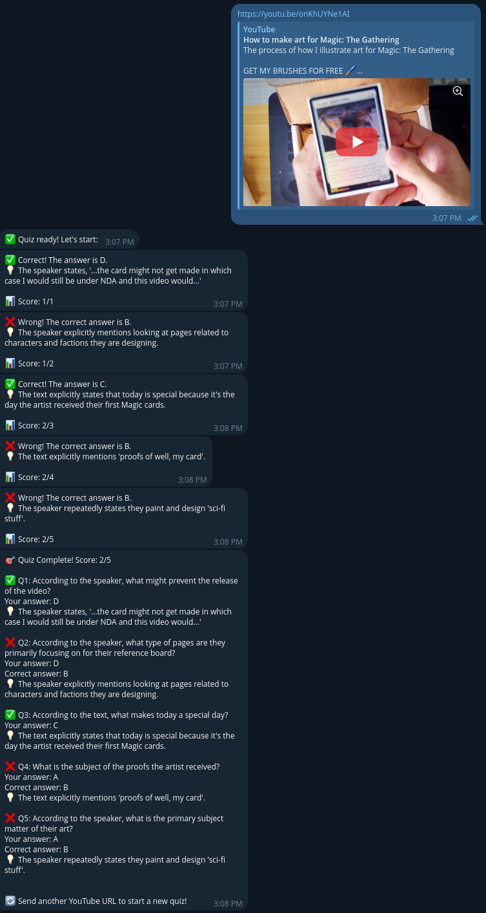

# YouTube Quiz Bot

A Telegram bot that converts YouTube video subtitles into interactive multiple-choice quizzes using LLama-CPP for AI generation.

## 🎯 Features

- **YouTube Integration**: Extracts subtitles from any public YouTube video
- **AI-Powered Quizzes**: Uses LLama-CPP to generate intelligent questions
- **Interactive Interface**: Multiple-choice questions with inline keyboards
- **Real-time Feedback**: Immediate response with explanations
- **Score Tracking**: Complete summary with detailed breakdown



## 🏗️ Architecture

```
Telegram Bot (python-telegram-bot) 
    ↓
Bot Controller (ConversationHandler)
    ↓
URL Parser → Subtitle API (yt-dlp) → Quiz Engine (LLama-CPP)
    ↓
In-memory Session Storage → Interactive Quiz Flow
```

## 📋 Prerequisites

- Python 3.11 or higher
- [uv](https://docs.astral.sh/uv/) package manager
- Running LLama-CPP server (local or remote)
- Telegram bot token from [@BotFather](https://t.me/BotFather)

## 🚀 Quick Start

### 1. Clone the Repository

```bash
git clone <your-repo-url>
cd youtube_quiz_bot
```

### 2. Install Dependencies

```bash
# Install uv if not present
curl -LsSf https://astral.sh/uv/install.sh | sh

# Install project dependencies
uv sync
```

### 3. Configure Environment

```bash
# Copy example environment file
cp .env.example .env

# Edit .env with your configurations
# TELEGRAM_BOT_TOKEN=your_bot_token_here
# LLAMA_CPP_ENDPOINT=http://127.0.0.1:10000/v1/chat/completions
```

### 4. Run the Bot

```bash
uv run python main.py
```

## ⚙️ Configuration

Create a `.env` file with the following variables:

| Variable | Description | Default | Required |
|----------|-------------|---------|----------|
| `TELEGRAM_BOT_TOKEN` | Bot token from BotFather | - | ✅ |
| `LLAMA_CPP_ENDPOINT` | LLama-CPP HTTP endpoint | `http://127.0.0.1:10000/v1/chat/completions` | ❌ |
| `NUM_QUESTIONS` | Default quiz questions count | `5` | ❌ |
| `YTDLP_EXTRA_ARGS` | Additional yt-dlp arguments | - | ❌ |
| `LOG_LEVEL` | Logging verbosity | `INFO` | ❌ |

## 🎮 Usage

### Bot Commands

- `/start` - Welcome message and instructions
- `/cancel` - Cancel current quiz session
- Send any YouTube URL to start a quiz

### Supported YouTube URL Formats

- `https://www.youtube.com/watch?v=VIDEO_ID`
- `https://youtu.be/VIDEO_ID`
- `https://m.youtube.com/watch?v=VIDEO_ID`

### Quiz Flow

1. **Send YouTube URL** → Bot validates and extracts subtitles
2. **Quiz Generation** → AI creates multiple-choice questions
3. **Interactive Quiz** → Answer questions using inline buttons
4. **Get Results** → Receive score and detailed explanations

## 🧪 Development

### Running Tests

```bash
# Run all tests
uv run python -m pytest

# Run with coverage
uv run python -m pytest --cov=src

# Run specific test file
uv run python -m pytest tests/test_bot.py -v
```

### Code Quality

```bash
# Lint code
uv run ruff check src/

# Format code
uv run ruff format src/

# Type checking
uv run mypy src/
```

### Project Structure

```
youtube_quiz_bot/
├── src/
│   ├── __init__.py
│   ├── bot.py          # Telegram bot handlers
│   ├── quiz_engine.py  # LLama-CPP integration
│   ├── subtitles.py    # YouTube subtitle extraction
│   ├── session.py      # Data models
│   └── config.py       # Configuration management
├── tests/
│   ├── test_bot.py
│   ├── test_quiz_engine.py
│   ├── test_subtitles.py
│   └── test_session.py
├── main.py             # Entry point
├── pyproject.toml      # Dependencies and tools
├── .env.example        # Environment template
└── README.md
```

## 🐳 Docker Deployment

Create a `Dockerfile`:

```dockerfile
FROM python:3.11-slim

WORKDIR /app

# Install uv
RUN pip install uv

# Copy project files
COPY pyproject.toml .
COPY src/ src/
COPY main.py .
COPY .env .env

# Install dependencies
RUN uv sync --frozen

# Run the bot
CMD ["uv", "run", "python", "main.py"]
```

Build and run:

```bash
docker build -t youtube-quiz-bot .
docker run -d youtube-quiz-bot
```

## 🔧 LLama-CPP Setup

The bot requires a running LLama-CPP server. Here's a basic setup:

```bash
# Clone and build llama.cpp
git clone https://github.com/ggerganov/llama.cpp
cd llama.cpp
make

# Download a model (example with Llama 3 8B)
wget https://huggingface.co/microsoft/Phi-3-mini-4k-instruct-gguf/resolve/main/Phi-3-mini-4k-instruct-q4.gguf

# Start server
./server -m Phi-3-mini-4k-instruct-q4.gguf -c 4096 --host 0.0.0.0 --port 10000
```

## 🔍 Troubleshooting

### Common Issues

**Bot doesn't respond to messages:**
- Check your bot token is correct
- Ensure the bot is running and accessible
- Verify network connectivity

**Subtitle extraction fails:**
- Video might not have subtitles
- Video could be private or restricted
- Check yt-dlp is working: `uv run yt-dlp --list-subs <VIDEO_URL>`

**Quiz generation errors:**
- LLama-CPP server might be down
- Check endpoint URL in configuration
- Verify model is loaded and working

**Import errors:**
- Run `uv sync` to install dependencies
- Check Python version (3.11+ required)

### Error Handling

The bot includes comprehensive error handling:

- **Network failures**: Automatic retries with exponential backoff
- **Missing subtitles**: User-friendly error messages
- **LLM failures**: Fallback behavior and retry logic
- **Invalid URLs**: Format validation and guidance

## 🤝 Contributing

1. Fork the repository
2. Create a feature branch: `git checkout -b feature-name`
3. Make your changes with tests
4. Run quality checks: `uv run ruff check src/ && uv run mypy src/`
5. Submit a pull request

### Development Guidelines

- Follow PEP 8 style guidelines
- Add comprehensive tests for new features
- Use type hints for all functions
- Include docstrings for public methods
- Update documentation for user-facing changes

## 📜 License

This project is licensed under the MIT License. See the LICENSE file for details.

## 🙋‍♂️ Support

For issues, questions, or contributions:

- Create an issue on GitHub
- Check existing documentation
- Review the troubleshooting section

## 🚀 Future Enhancements

- **Persistent Sessions**: Redis storage for session survival
- **Multiple Languages**: Detect and generate questions in video language
- **Difficulty Levels**: Adaptive question complexity
- **User Profiles**: Score tracking and leaderboards
- **Voice Questions**: Audio output for accessibility
- **Custom Models**: Support for different LLM backends
